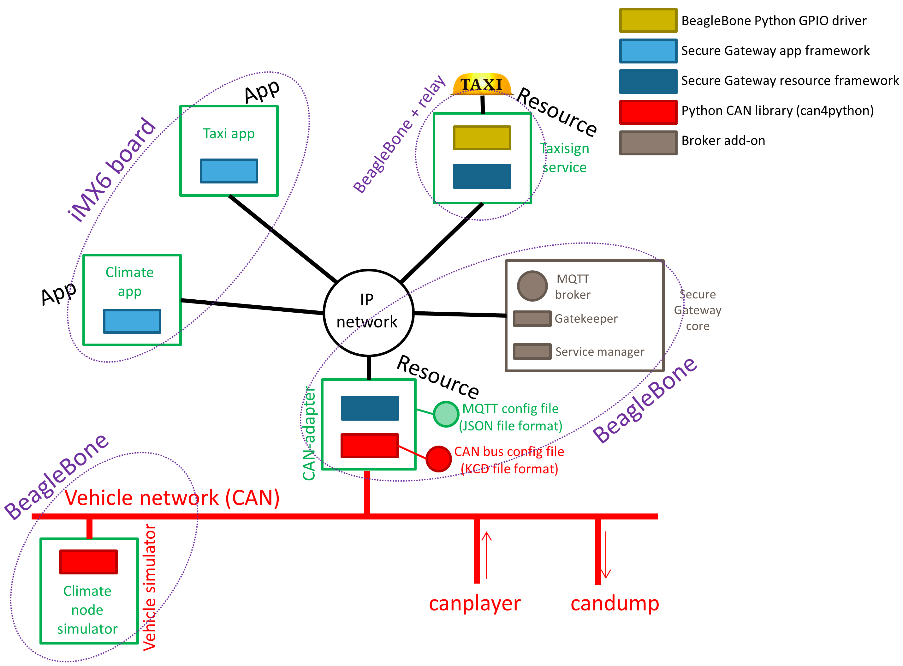

 SecureGateway
===============
Secure Gateway (SG) is an architecture concept, using Internet technology in automotive and 
industrial environments. 

This is work in progress, and the source will be released gradually. Now the can4python library 
has been released. It is a Python package for handling CAN signals, and is a key component 
in the Secure Gateway. See a neighbouring repository here on Caran open source portal.

Also the 10+ page tutorial has been released. See the doc folder in this repository.

The paper "Secure Gateway – A concept for an in-vehicle IP network bridging the infotainment and the safety 
critical domains" was presesented at the ESCAR2015 USA conference. The paper is found in the doc folder.

For more information, please contact caranopensource at semcon.com 

