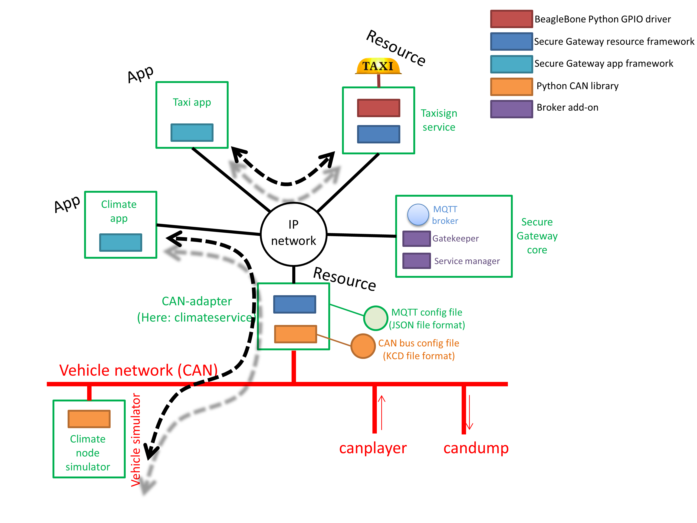

Examples for sgframework
========================
This section describes the examples distributed with the source for sgframework.

The first example describes an after-market hardware attached to the Secure
Gateway IP-based network. It is a taxisign (resource) controlled by an app.

Second example shows the usage of certificates for encrypted communication discussed before.

Finally, in the third example is a CAN-bus connected vehicle simulator
(for a climate node) controlled by an infotainment app.

An overview of the network and software components is shown in the image below.

.. toctree::
   :maxdepth: 2
   
   taxisigntutorial
   certificatetutorial
   cantutorial
   vehiclesimulatortutorial

