Approximate Canadaper performance
===================================
To get an idea of how many CAN frames per second the Canadapter is able to unpack,
measurements have been done by running it on various embedded Linux boards.

Methods for measuring the performance are described in another section.

Summary
----------------------
The maximum CAN frame unpacking rate is heavily dependent on which
embedded Linux hardware the Canadapter is running on. The results are
approximately:

* Raspberry Pi version 1: 60 frames/second
* Beaglebone Black: 130 frames/second
* Raspberry Pi version 3: 580 frames/second

The measurements were done with a CAN bitrate of 500 kbit/second.

Note that this is how many of the frames that are actually unpacked.
It is perfectly fine to use the Canadapter on CAN buses with higher total frame rates,
just adjust the KCD configuration file to select the CAN frames you are interested in.

CAN frames are most often sent peridocally, for example, the CAN frame with information
on the vehicle speed might be sent with a period of 10 ms. If it is sufficient for you to
have 10 MQTT messages per seconds informing about the vehiclespeed, set the
throttling for that CAN frame to 100 ms. This reduces the processing power required by 90%.

Handle performance issues
------------------------------------------------
The upper limit on the CAN frame unpacking rate is the available processing power.
When reaching the upper limit there will be a lag (delay) between the CAN frame input and the MQTT message output,
and eventually there will be loss of CAN frames. 

Here are a few ideas to improve the performance:

* Unpack only the CAN frames you actually need (controlled by the KCD configuration file).
* Throttle the frequency of incoming CAN frames (achieve a low lag by dropping some of the periodic CAN frames).
* Use MQTT QoS level 0.
* Make sure your hardware is running at max processor frequency.
* Disable the graphical user interface (GUI) in order to save processing power.
* Use a powerful hardware, for example, the Raspberry Pi 3.

Performance on Beaglebone Black
--------------------------------
The CPU and memory consumption have been measured for the different processes on a Beaglebone Black (running without a GUI).

It is seen that the Canadapter process is the most CPU consuming, and
the CPU consumption increases linearly with the CAN frame unpacking rate.
Also the CPU consumption for the Mosquitto MQTT broker is increasing with the MQTT message rate.

The CPU consumption of the Canadapter process increases until there is no idle CPU power available.

None of the processes seem to consume much memory, but the total memory usage is increasing over time.

The memory usage doesn't seem to limit the CAN frame unpacking rate.

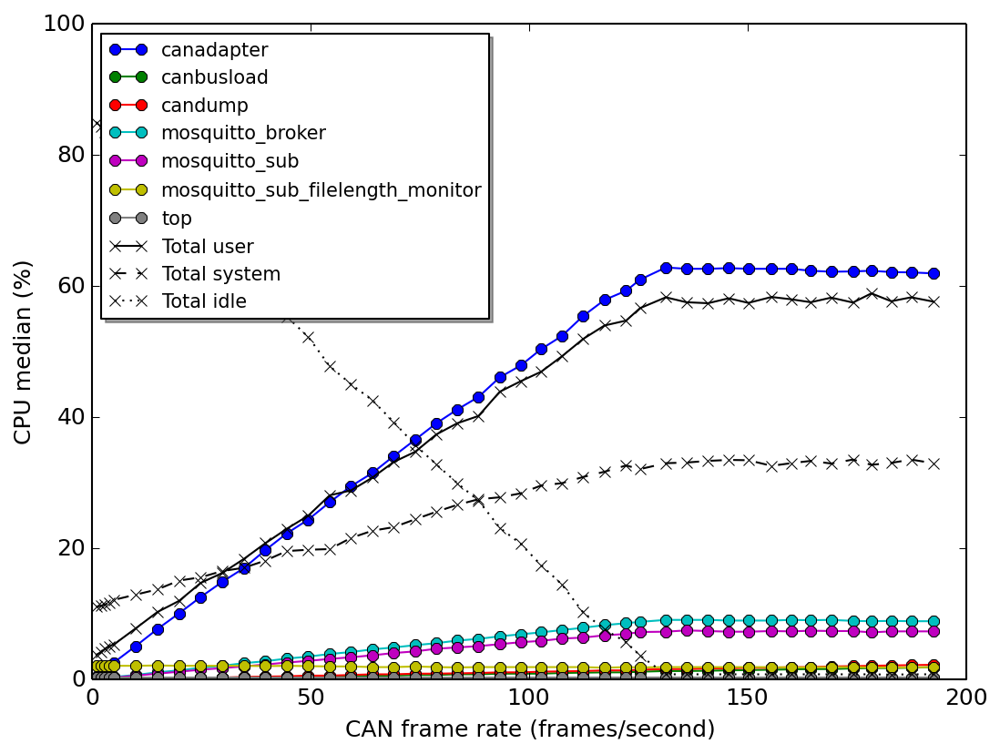

   CPU usage for a Beaglebone Black running without a GUI.

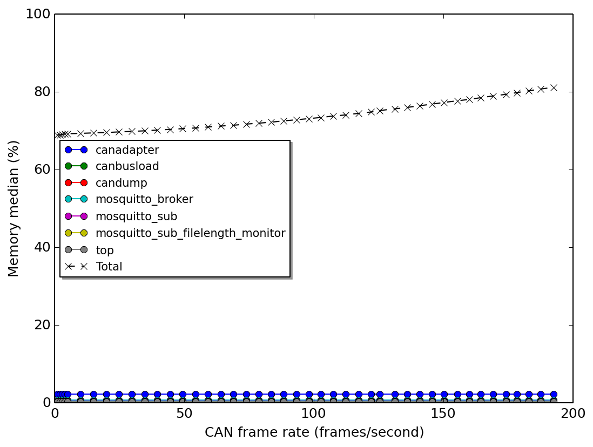

   Memory usage for a Beaglebone Black running without a GUI.

Comparison of boards
----------------------
These embedded Linux boards have been compared:

* Beaglebone Black (BBB)
* Raspberry Pi 1 (RPi1)
* Raspberry Pi 3 (RPi3)

As running a graphical user interface (GUI) is consuming processor power,
the measurements have been done both with the GUI enabled and disabled.

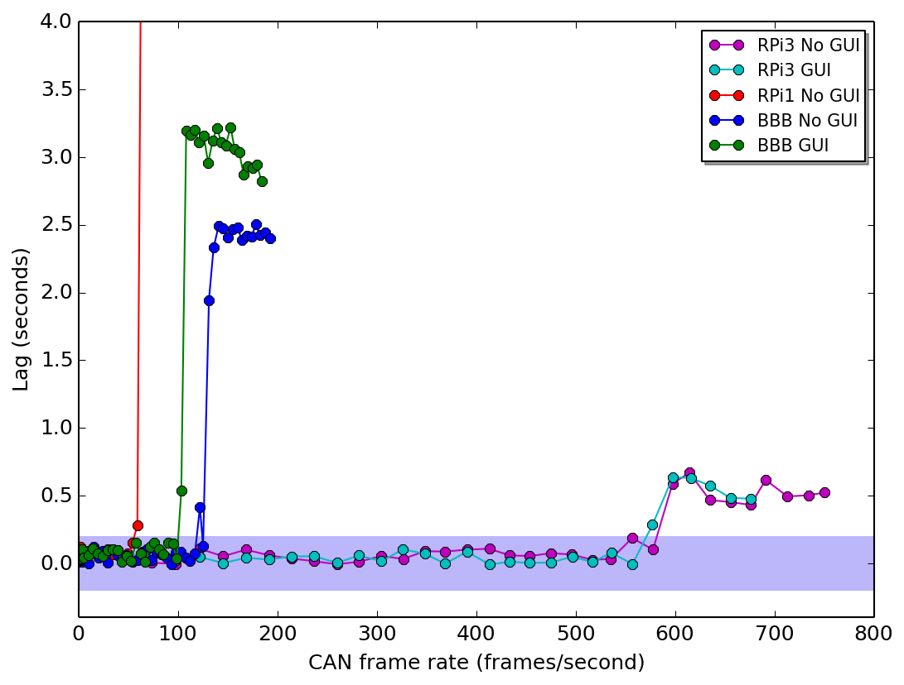

   Lag versus CAN frame rate for different embedded Linux boards.

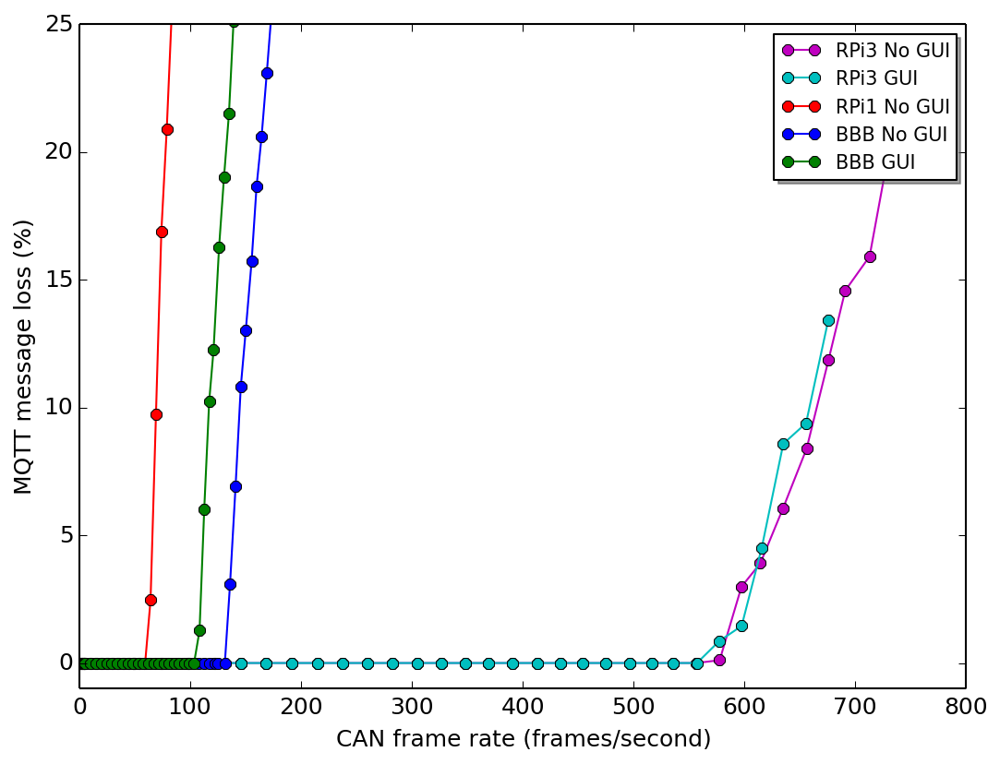

   Loss versus CAN frame rate for different embedded Linux boards.

It is seen in the lag and loss graphs that when it starts to be a lag in the
processsing of the CAN frames, there is also a message loss.

The Beaglebone Black is faster than the Raspberry Pi1, but the fastest board
is the Raspberry Pi3. For Beaglebone Black, which is having a single core,
running the GUI reduces the processing power available for the Canadapter.

From the CPU usage graph it is clear that the lag appears when there is no more
processing power available (the CPU idle drops to zero for single core machines).

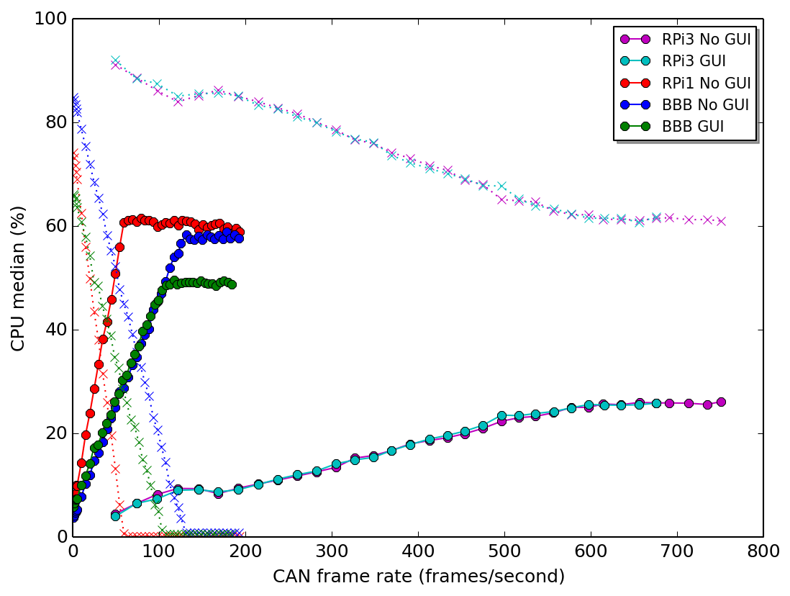

   CPU usage. The solid lines are 'total user CPU usage', and the dotted lines are 'CPU idle'.
   
For Raspberry 3, which has four cores, the lag appears when the core running
the Canadapter is fully utilized. This is seen more clearly in the graph
for the Raspberry Pi 3 CPU usage. The curve for Canadapter CPU usage
reached 100% (of a single core) at the CAN frame rate at which the lag appears.
As there are four cores, the 'user's total CPU usage' reaches approximately 25%
at this point.

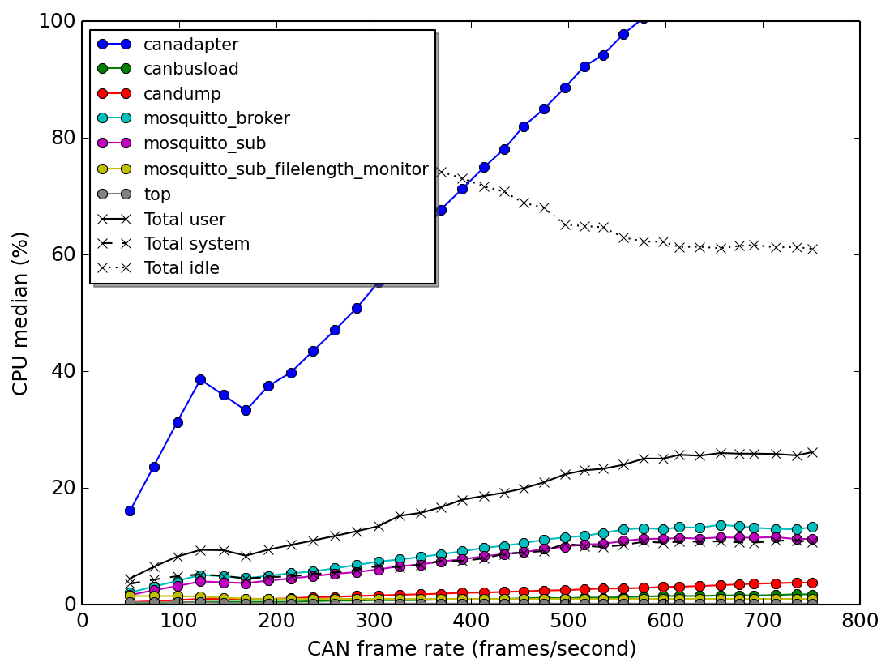

   CPU usage for Raspberry Pi 3.

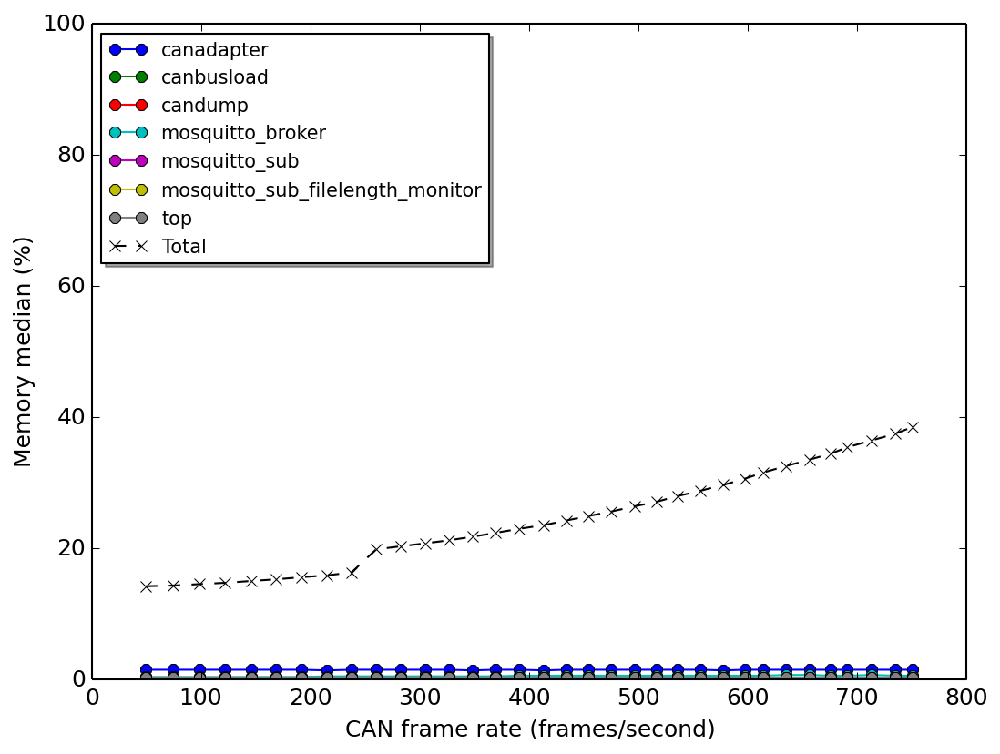

   Memory usage for Raspberry Pi 3.

   
Processor frequency
------------------------------
The effect of the CPU frequency on the Canadapter performace has been studied on Beaglebone Black.
The result is:

* 1000 MHz: 130 frames/second
* 800 MHz:  110 frames/second
* 600 MHz:  90 frames/second
* 300 MHz:  50 frames/second

It is obvious that higher CPU frequency allows higher CAN frame unpacking rates.

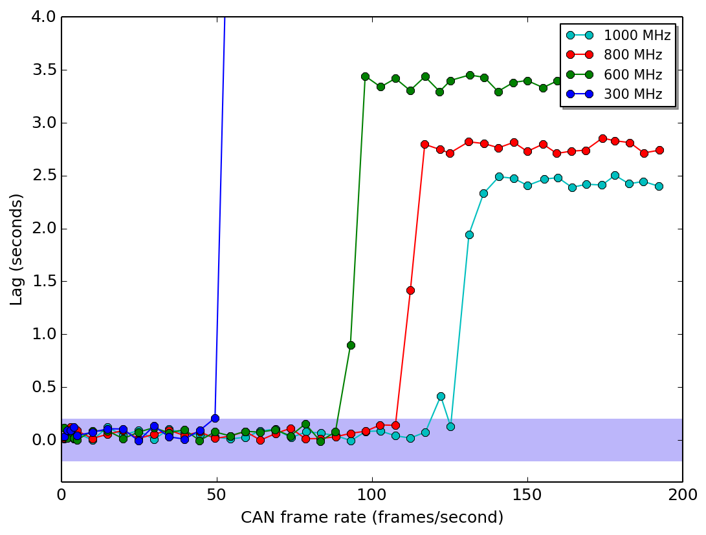

   Lag for different CPU frequencies on Beaglebone Black.

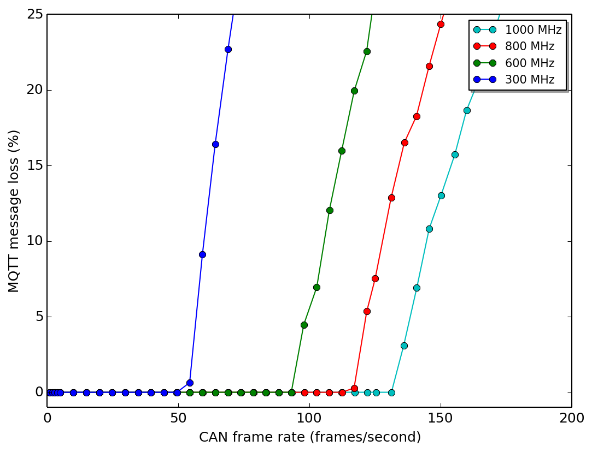

    Message loss for different CPU frequencies on Beaglebone Black.
   
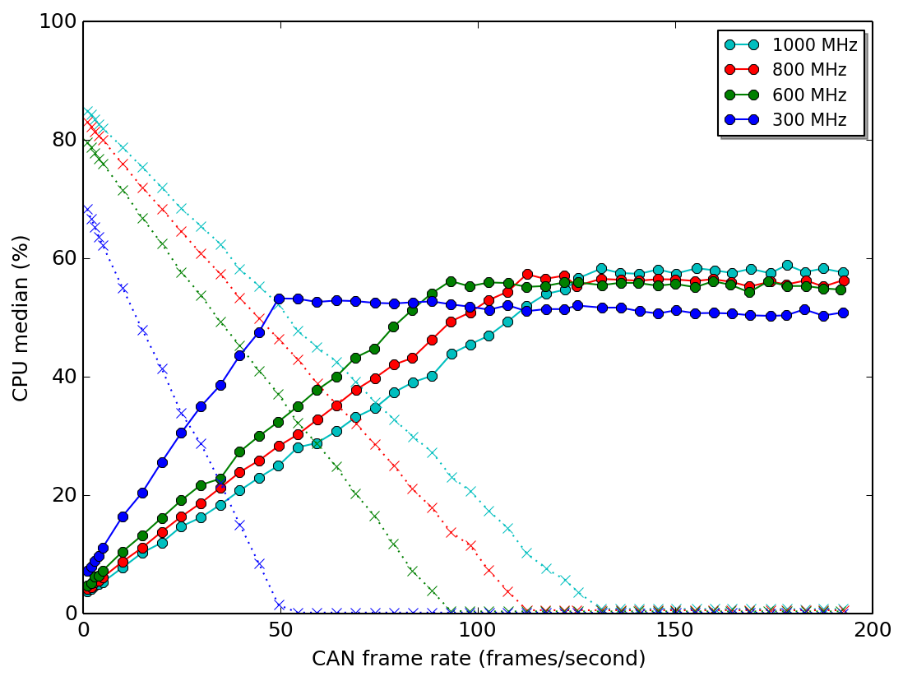

   Total user CPU usage (solid line) and CPU idle (dotted line) for different CPU frequencies on Beaglebone Black.

The total memory usage is increasing between different runs. It is not clear whether this is related to the CPU frequency.

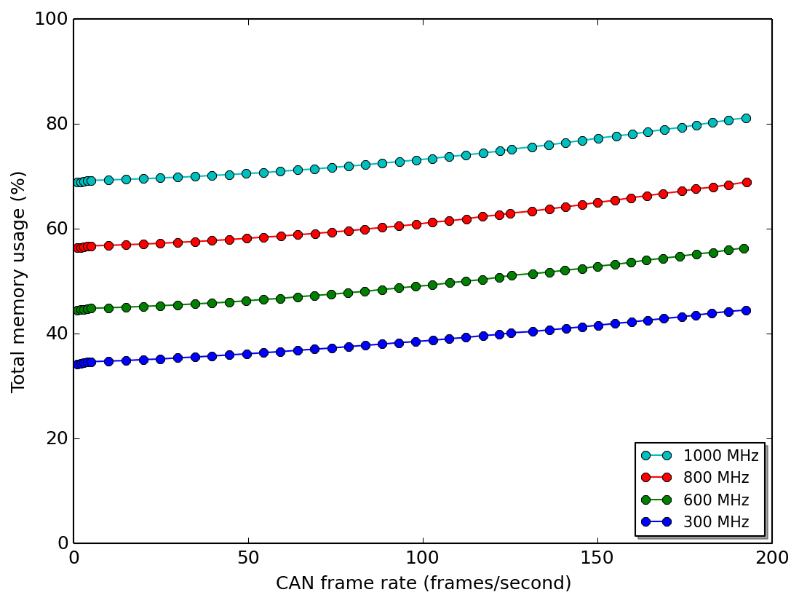

   Total memory usage for different CPU frequencies on Beaglebone Black.
   

MQTT Quality-of-Service (QoS)
-----------------------------------------
A higher QoS level requires more processing power to handle the MQTT communication,
and thus lowers the maximum CAN frame's unpacking rate.
These are approximate numbers for Beaglebone Black:

* QoS 0: 130 frames/second
* QoS 1: 105 frames/second
* QoS 2: 110 frames/second

Throttling of incoming CAN frame rate
--------------------------------------
One way to avoid lag (delay) in the processing of incoming CAN frames
is to use throttling. This means that, for example, a CAN frame with a period
of 10 ms is downsampled to a period of 100 ms, in order to save
processing power.

Measurements have been done on Beaglebone Black.

It is seen in the figures below that throttling is completely solving the lag
problem, given that the period is long enough. Of course this leads to message loss.

The CAN frame rate downsampling is done in the Linux kernel, which saves on the
processing power (as seen in the last graph).

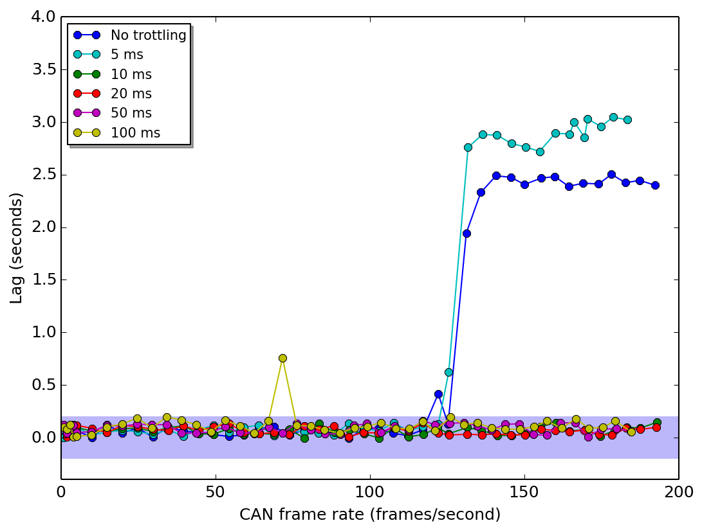

   Lag for different throttle settings on Beaglebone Black.

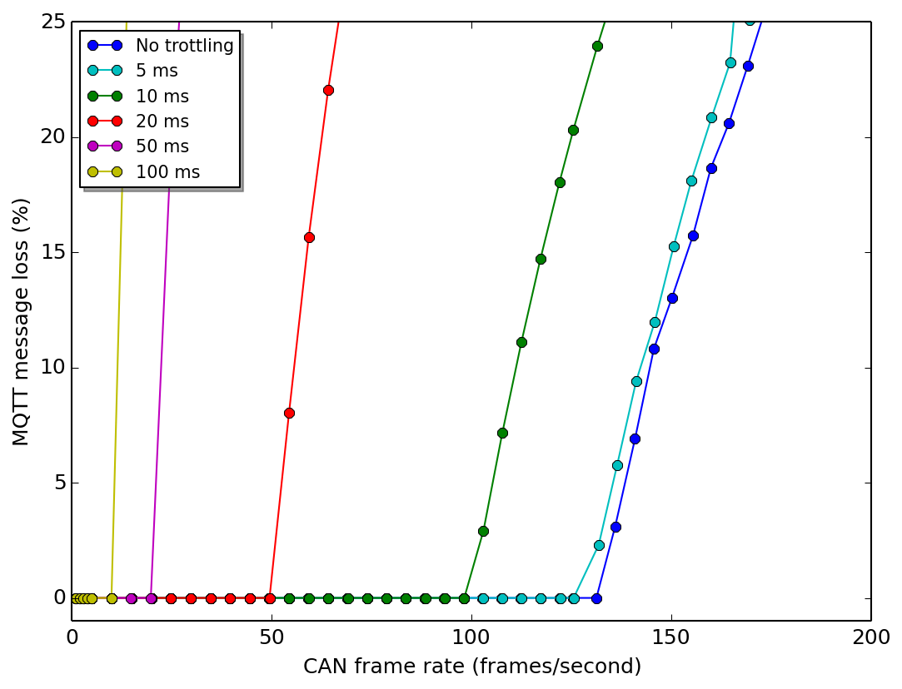

   Message loss for different throttle settings on Beaglebone Black.

.. figure:: images/cpu_total_BBB_throttling_User_and_Idle.png

   Total user CPU usage (solid line) and CPU idle (dotted line) for different throttle settings on Beaglebone Black. 

Measurement data
-----------------

========== ====== ===== ======== ==== ==== ============ ================
Date       Time   Board CPU      QoS  GUI  Throttling   Result
========== ====== ===== ======== ==== ==== ============ ================
2016-08-26 071458 BBB   1000 MHz 2    No   No           110 Hz
2016-08-29 075740 BBB   300 MHz  0    No   No           50 Hz
2016-08-29 095732 BBB   600 MHz  0    No   No           90 Hz
2016-08-29 121348 BBB   800 MHz  0    No   No           110 Hz
2016-08-29 134655 BBB   1000 MHz 0    No   No           130 Hz
2016-08-30 113319 BBB   1000 MHz 1    No   No           105 Hz
2016-08-30 131155 BBB   1000 MHz 0    No   10 ms        100 Hz
2016-08-31 052316 BBB   1000 MHz 0    No   20 ms        50 Hz
2016-08-31 070806 BBB   1000 MHz 0    No   5 ms         130 Hz
2016-08-31 085031 BBB   1000 MHz 0    No   50 ms        20 Hz
2016-08-31 103256 BBB   1000 MHz 0    No   100 ms       10 Hz
2016-08-31 134958 BBB   1000 MHz 0    Yes  No           100 Hz
2016-09-05 144112 RPi1  Default  0    No   No           60 Hz
2016-09-12 070555 RPi3  Default  0    Yes  No           560 Hz
2016-09-13 060714 RPi3  Default  0    No   No           580 Hz
========== ====== ===== ======== ==== ==== ============ ================
