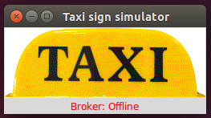
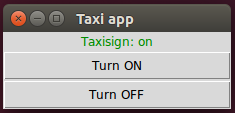
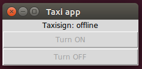

Taxi sign and corresponding app
===============================

As an example resource, a taxi sign service has been created. It is one rather
naive example of what could be added to a passenger car and would benefit from
having a user interface in the infotainment head unit.

This taxi sign resource is a graphical application for running on Ubuntu, and will
show a taxi sign lit up or turned off. The resource can also be used in command-line
only mode (for use on Linux machines without graphics) or even connected to a
real taxi sign with a light bulb. See below how to build your own taxi sign hardware
controlled by a Beaglebone!

Taxi sign resource
-------------------

Minimum Python 3.3 should be used for this software to run properly. 

To find usage information on this (and other scripts mentioned in this section), use the -h command line switch::
 
    $ python3 examples/taxisignservice/taxisignservice.py -h
 

The taxi sign service listens to this command::
 
    command/taxisignservice/state True
 
and it will respond on the corresponding data topic.

To test the taxisign resource, run this in three different terminal windows::
 
    $ mosquitto_sub -t +/#  -v
    $ python3 examples/taxisignservice/taxisignservice.py -v -mode graphical 
    $ mosquitto_pub -t command/taxisignservice/state -m True
 
The last command will turn on the taxi sign. Using 'False' as payload will turn it off. This is how the taxi sign looks like when on, and off (and in addition disconnected from the broker) respectively:

 
As seen in the mosquitto_sub window, also availability data is sent upon startup::
 
    resourceavailable/taxisignservice/presence True
    commandavailable/taxisignservice/state True
    dataavailable/taxisignservice/state True

    data/taxisignservice/state False
 

Kill the taxisignservice process to see the last will being sent from the broker.
The service manager will send out the ``presence`` information for the individual signals.

Try it using::
 
    $ ps -ef
    $ kill <PID for taxisignservice>
 

Taxi sign application
---------------------

The taxi sign app (application) is a graphical program that is turning on or off
the taxi sign (simulated or real hardware). The taxi sign app can also be used in
command-line only mode (for use on Linux machines without graphics).

First test the taxi sign app standalone, with a broker only (make sure the broker is running). 
Start the taxi sign app in graphical mode::
 
    $ python3 examples/taxisignapp/taxisignapp.py -mode graphical
 

In a separate terminal window, send information to the taxi sign app that
the taxi sign resource is online and that the sign is lit up::
 
    $ mosquitto_pub -t resourceavailable/taxisignservice/presence -m True
    $ mosquitto_pub -t data/taxisignservice/state -m True
 

In yet another terminal window, listen to all MQTT commands::
 
    $ mosquitto_sub -t +/#  -v
    

Then press the buttons on the taxi sign app. It will show something like this::
    
    command/taxisignservice/state True
    command/taxisignservice/state False

This is how the taxi sign app looks like, when the taxi sign is on, and when the taxi sign is disconnected from the broker:

Now it is time to test the taxi sign app and the taxi sign resource together. Run these in separate terminal windows::
 
    $ python3 examples/taxisignapp/taxisignapp.py -v -mode graphical
    $ python3 examples/taxisignservice/taxisignservice.py -v -mode graphical 
 

Try for example to kill the broker and then start it again.

Help texts for the taxi sign resource and app
---------------------------------------------------

Details of usage for the taxi sign related examples are found here: 

.. command-output:: python3 examples/taxisignservice/taxisignservice.py -h
   :cwd: ..

.. command-output:: python3 examples/taxisignapp/taxisignapp.py -h
   :cwd: ..

Build your own Secure Gateway enabled taxi sign hardware
--------------------------------------------------------

The taxisignservice resource software is handling turning on and off a digital output pin on a BeagleBone or Raspberry Pi embedded Linux computer board. Use the command:: 
 
    $ sudo python3 taxisignservice.py -v -mode hardware -host 192.168.0.93 
 
Replace the IP number with your broker's IP number. Due to the hardware manipulation on the Beaglebone/Pi, you must run the program in 'sudo' mode.

Connect the output GPIO pin to a relay driver. The GPIO pin number to use is defined in the taxisigndriver file, and there is also more technical information in that file. A power supply and a lightbulb are connected to the relay. Cheap taxi sign fixtures are available on several of the common low-price marketplaces on the Internet.

Set the broker IP number manually when starting the taxisignservice, or write a small startscript that uses Avahi to find the broker IP number.

To test the GPIO output driver::
 
    $ sudo python3 examples/taxisignservice/drivers/taxisign_driver.py
