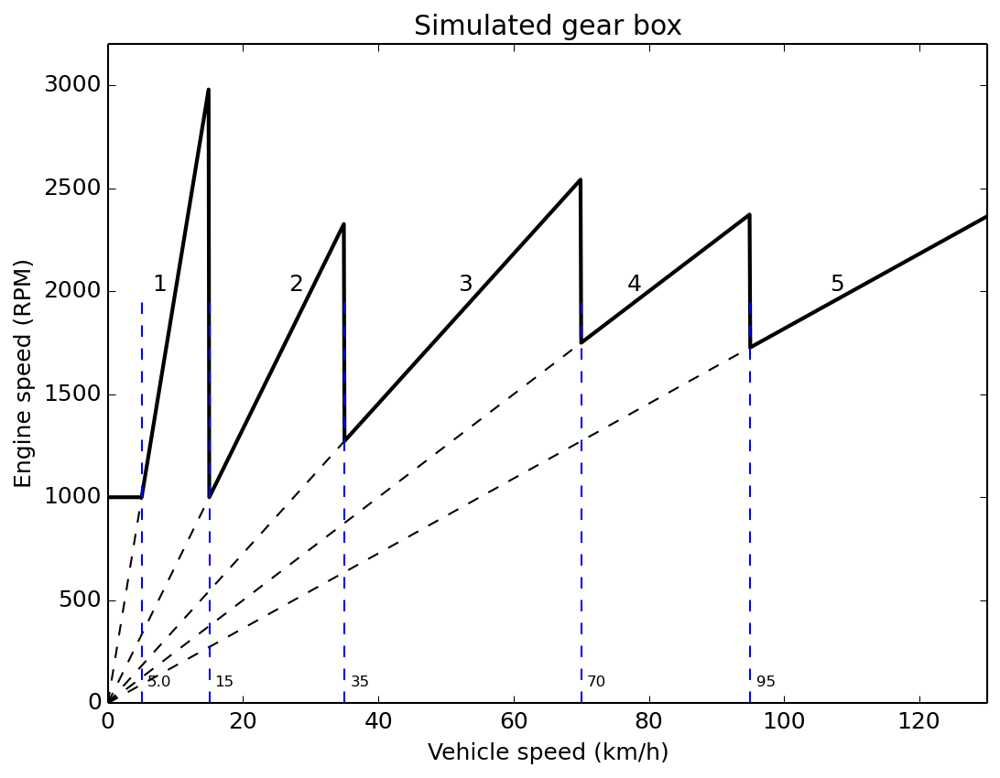
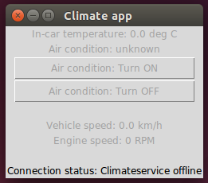

Vehicle simulator and corresponding app
=======================================

Simulated climate node (which is a CAN simulator or vehicle simulator)
--------------------------------------------------------------------------
There is a vehicle simulator available among the Secure Gateway examples.
It will send out CAN messages on a real or simulated CAN bus. The CAN messages contain
signals describing the vehicle speed, the engine speed and the in-car temperature.
The simulator listens to control signals on the CAN bus to turn on or off
the simulated air condition (affects the in-car temperature). 

The vehicle speed is increased in small, random steps. When reaching the maximum
speed, it is instead decreased in small, random steps. The engine speed is 
calculated from the vehicle speed, as seen in this figure:

To test the vehicle simulator, run these commands in two different terminal windows::
 
    $ candump vcan0
    $ python3 examples/vehiclesimulator/vehiclesimulator.py -v
    
This will print out the simulated values, and the send CAN frames, respectively. 

In order to turn on the simulated air condition, run this command from yet another terminal window::
 
    $ cansend vcan0 007#8000000000000000
 
To turn off the air condition::
 
    $ cansend vcan0 007#0000000000000000
 
Note the resulting changes in the simulated in-car temperature.

Climate resource (converts CAN messages to MQTT)
------------------------------------------------
The climate resource converts data from CAN frames, and sends it to MQTT messages.
It also converts commands in MQTT messages to CAN frames. The climate
resource is implemented using the canadapter script with appropriate
configuration files.

These MQTT topics are used by the canadapter (configured to run as a climate
resource named climateservice)::
 
    command/climateservice/aircondition 1
    data/climateservice/aircondition 1
    data/climateservice/actualindoortemperature 27.5
    data/engineservice/vehiclespeed 67.5
    data/engineservice/enginespeed 2354
 
Basically it sends out MQTT data describing the vehiclespeed, enginespeed etc,
and listens to MQTT commands to turn the air condition on and off.

In addition these availability topics are sent at startup::
 
    resourceavailable/climateservice/presence True

    dataavailable/climateservice/actualindoortemperature True
    dataavailable/climateservice/vehiclespeed True
    dataavailable/climateservice/enginespeed True

    commandavailable/climateservice/aircondition True
    dataavailable/climateservice/aircondition True

To test the canadapter, run these commands in three different terminal windows
(from sgframework project root directory, after installation)::
 
    $ python3 examples/vehiclesimulator/vehiclesimulator.py -v
    $ canadapter examples/configfilesForCanadapter/climateservice_cansignals.kcd -mqttfile examples/configfilesForCanadapter/climateservice_mqttsignals.json -mqttname climateservice -v
    $ mosquitto_sub -t +/# -v

In order to turn on and off the air condition, run this command in yet another terminal window::
 
    $ mosquitto_pub -t command/climateservice/aircondition -m 1

An example of data on the canbus (as printed by ``candump vcan0``)::

    vcan0  009   [8]  03 32 00 00 00 00 00 00
    vcan0  008   [8]  0F E9 17 24 00 00 00 00
    vcan0  007   [8]  80 00 00 00 00 00 00 00
    vcan0  009   [8]  03 2A 00 00 00 00 00 00
    vcan0  008   [8]  10 0B 17 54 00 00 00 00

Note that the aircondition command is echoed back (as data) from the canadapter,
not from the vehiclesimulator itself. This means that the ``data/climateservice/aircondition``
signal might be out of sync with the state of the vehicle simulator.
A more advanced usage would be to echo the command in a separate CAN message from the vehiclesimulator,
and convert that information to the mentioned MQTT message.
This can easily be set for the canadapter by using the configuration file. 

Several canadapters can be running in parallel, each handling a few CAN messages.
These canadapters are then different resources on the Secure Gateway network,
and could require different permission levels for usage. 

Use as few CAN definition files as possible (in the KCD file format),
as canadapter uses message filtering in the Linux kernel for the messages defined in the file.

Generate data in the 'climatesimulationdata' CAN frame (id 0x009, once per 100 ms)::

    $ cangen vcan0 -I 009 -L 8 -D i -g 100

Generate data in the 'vehiclesimulationdata' CAN frame (id 0x008, once per 100 ms)::

    $ cangen vcan0 -I 008 -L 8 -D i -g 100

Climate MQTT app
-----------------
Distributed with the Secure Gateway is a climate app listening to the climate service
and controlling the air condition. It has a graphical user interface, but
can also be used from the command line (useful for embedded Linux boards).

Start the app::

    $ python3 examples/climateapp/climateapp.py -mode graphical
 
To test the climate app standalone, with a broker only::
 
    $ mosquitto_pub -t resourceavailable/climateservice/presence -m True
    $ mosquitto_pub -t data/climateservice/vehiclespeed -m 27.1
    $ mosquitto_pub -t data/climateservice/enginespeed -m 1719
    $ mosquitto_pub -t data/climateservice/actualindoortemperature -m 31.6
    $ mosquitto_pub -t data/climateservice/aircondition -m 1

    $ mosquitto_sub -t +/#  -v

Or you can use a one-liner for the above mosquitto commands::

    $ mosquitto_pub -t resourceavailable/climateservice/presence -m True && mosquitto_pub -t data/climateservice/vehiclespeed -m 27.1 && mosquitto_pub -t data/climateservice/enginespeed -m 1719 && mosquitto_pub -t data/climateservice/actualindoortemperature -m 31.6 && mosquitto_pub -t data/climateservice/aircondition -m 1 && mosquitto_sub -t +/#  -v

 
Next, the climate app should be tested together with the vehicle simulator and the canadapter.
Then it will show the present in-car temperature and can control the air condition.
Also the vehicle speed, engine speed, connection status to the broker and the
presence information for the climateservice will be displayed. 

This is how the climate app looks like when the air condition is on, and when
the climate service is disconnected from the broker:

.. image:: images/ClimateApp_On.png
   :width: 200 px

Instead of using the vehiclesimulator, the climateapp can be tested with
the recorded CAN log file and the canadapter.

CAN communication using real CAN bus
-------------------------------------
Set up the CAN communication between the two embedded Linux machines
as described earlier.

On the first machine run the vehicle simulator using the real CAN interface::

    $ python3 examples/vehiclesimulator/vehiclesimulator.py -v -i can0

On the second machine, verify that it receives CAN data::

    $ candump can0

To turn on the air condition in the vehicle simulator (on the first machine)
run this on the second machine::

    $ cansend can0 007#8000000000000000

Then on the second machine run the canadapter using the real CAN interface::

    $ canadapter examples/configfilesForCanadapter/climateservice_cansignals.kcd -mqttfile examples/configfilesForCanadapter/climateservice_mqttsignals.json -mqttname climateservice -v -i can0

Note that the broker must be running.

On the second machine, verify that MQTT messages are sent::

    $ mosquitto_sub -t +/# -v

Run the climate app (non-graphical mode) on the second machine (press and hold Enter key for continuous updates)::

    $ python3 examples/climateapp/climateapp.py 

To run the climate app in graphical mode, use a laptop connected to the same network as the machine running
the canadapter. Verify that the laptop receives the MQTT messages (use the IP number of the broker, typically on the second machine)::

    $ mosquitto_sub -t +/# -v -h IPNUMBER_OF_BROKER

Run the climate app in graphical mode on the laptop::

    $ python3 examples/climateapp/climateapp.py -mode graphical -host IPNUMBER_OF_BROKER

Help texts for the vehicle simulator and the climate app
------------------------------------------------------------

.. command-output:: python3 examples/vehiclesimulator/vehiclesimulator.py -h
   :cwd: ..

.. command-output:: python3 examples/climateapp/climateapp.py -h
   :cwd: ..
